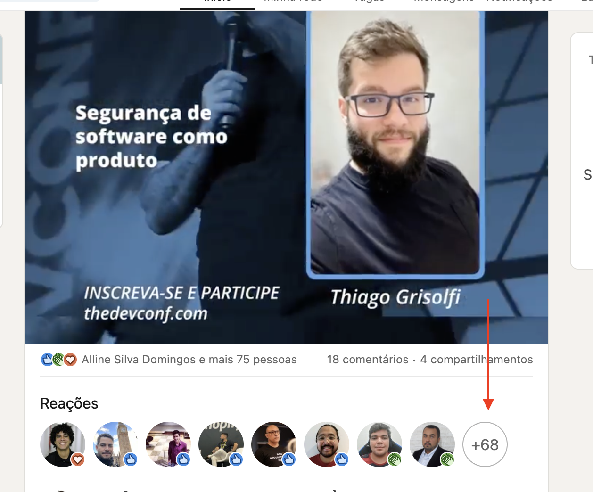
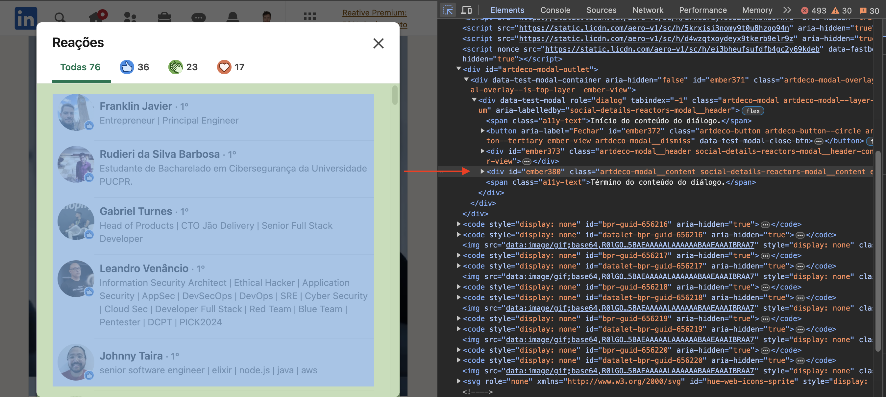
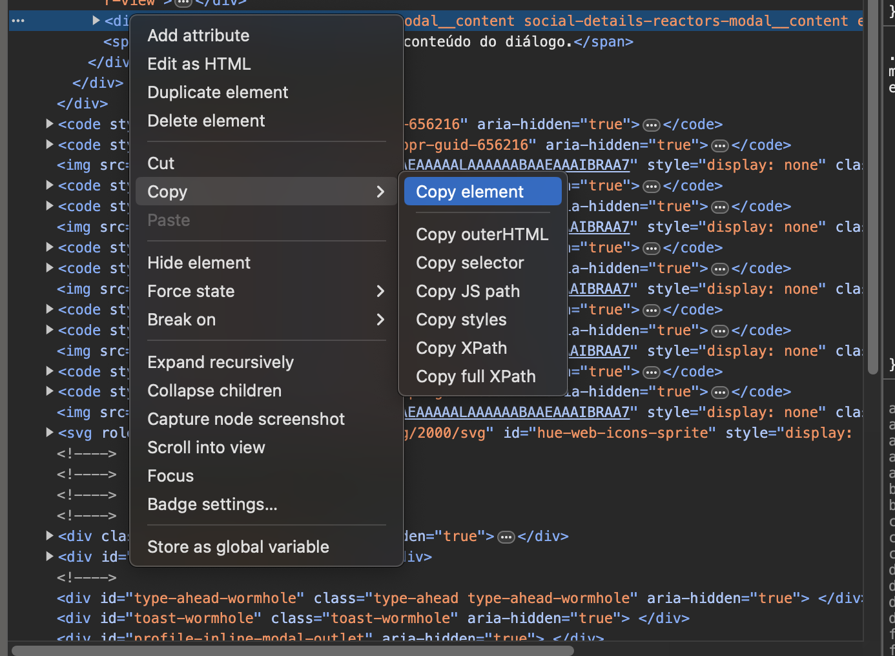

> [!WARNING]
> Este projeto é apenas para fins educacionais e de aprendizado. O uso indevido ou abusivo dessa automação pode violar os termos de serviço do LinkedIn. Utilize-o com responsabilidade.  

# Sorteio de Reações no LinkedIn

Este é um pequeno projeto de automação para extrair reações no LinkedIn e realizar o sorteio de um usuário que tenha reagido a esta postagem.

## Contexto

O LinkedIn possui uma série de etapas para obtenção de uma chave de API para obtenção do acesso à [Community Management API](https://learn.microsoft.com/en-us/linkedin/marketing/community-management/community-management-api-migration-guide?view=li-lms-2024-05#community-management-api), e após aprovado, então poder interagir com as reações de um post de forma programática.

Diante da dificuldade que encontrei de criar um sorteio de forma rápida, recorri a esse método de web scraping que pode não funcionar para sempre, mas pode ser atualizado.

## Pré-requisitos

Antes de executar o script de automação, é necessário seguir o passo-a-passo abaixo:

1. Navegue até as reações da postagem desejada

1. Carregue todos os usuários que curtiram sua públicação (isso pode ser bem tedioso se o post for popular.)
1. Utilizando as ferramentas do desenvolvedor (F12), localize o elemento que agrega todas as pessoas

1. Copie o elemento HTML todo, no meu caso foi o de id `ember380`

1. Cole o conteúdo em um [gist](https://gist.github.com) público. Certifique-se que o HTML do container de reações do LinkedIn está como o inspecionado.

## Funcionamento

A automação contida em [extract.py](extract.py) realiza utiliza a biblioteca `beautifulsoup` para realizar uma extração dos nomes que reagiram a postagem extraída.  
Para o sorteio, foi utilizada a biblioteca [secrets](https://docs.python.org/3/library/secrets.html).

Para facilitar o re-uso, inseri um [workflow](.github/workflows/draw.yml) com trigger manual (workflow_dispatch) e variável contendo a URL do Gist utilizado.